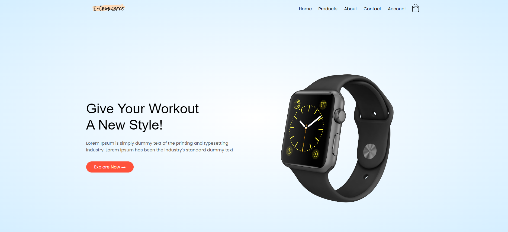
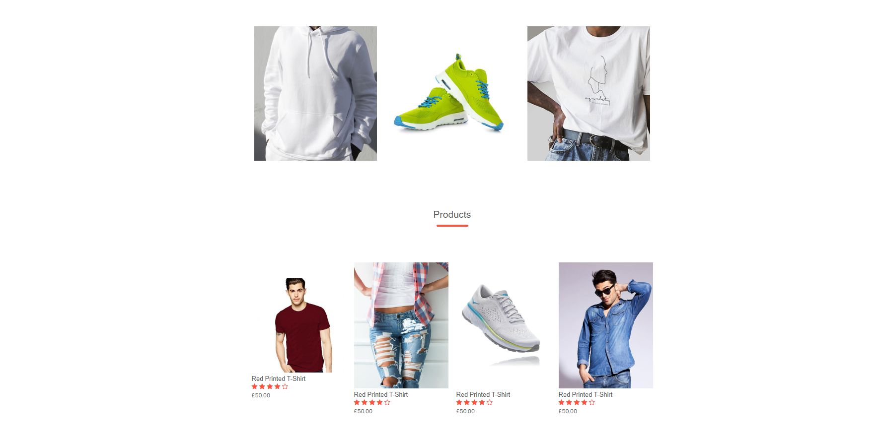
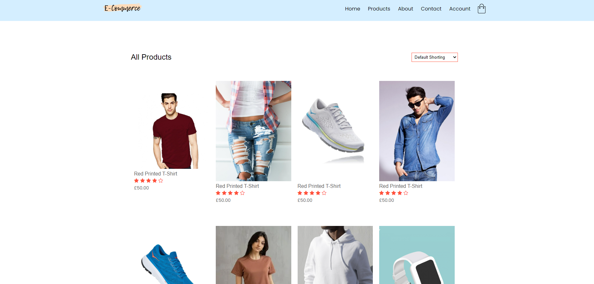
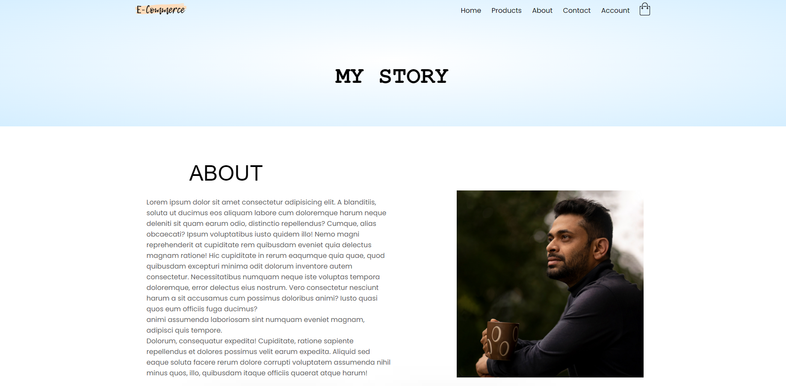
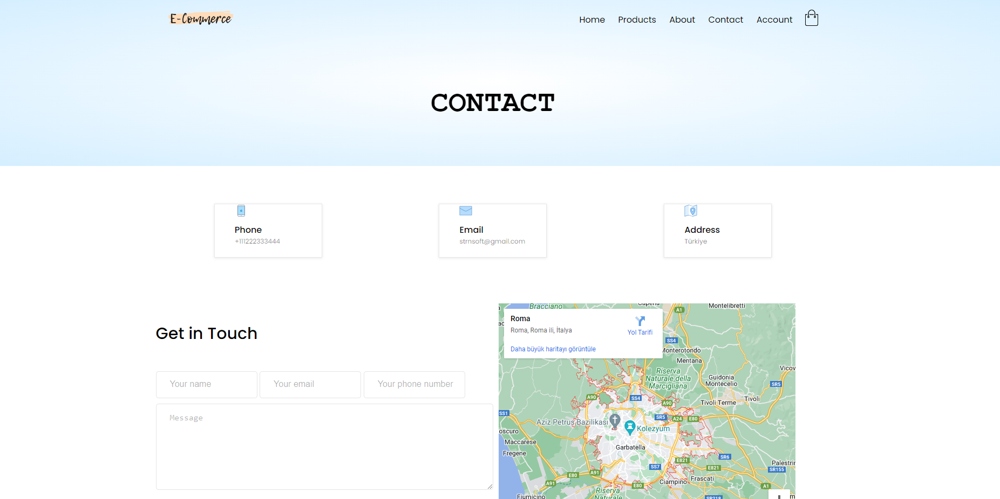
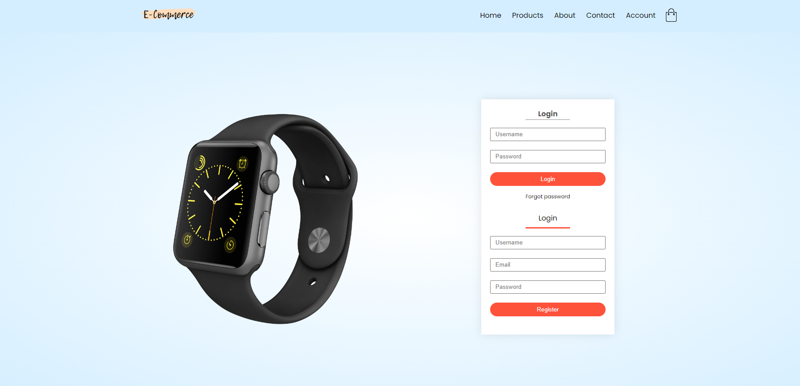

<h1>E-Commerce Themes</h1>

In this project, I developed e-commerce related to themes. Html, Css and Bootstrap are used in this project.

<h2>Content</h2>

I want to talk about this project. The project includes home page, products, about, contact and account pages.

<h3>Home Page</h3>

<h3>Home Page</h3>

<h3>Products Page</h3>

<h3>About Page</h3>

<h3>Contact Page</h3>

<h3>Account Page</h3>

